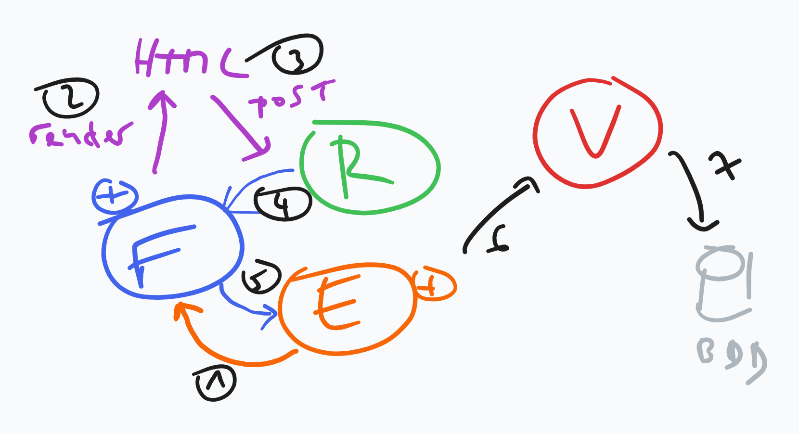

# Workflow du formulaire



## 1. Création ou récupération Entité

:warning: Depuis une requête HTTP en GET, on affiche un formulaire.

On a une entité `$review`.

Par ex. `$review = new Review();`

## 1bis. On crée un formulaire

Depuis un `Type` ici `ReviewType` et on lui transmet l'entité par défaut, ici `$review`.

par ex. `$form = $this->createForm(ReviewType::class, $review);`

## 2. On rend le form en HTML

```php
return $this->renderForm('review/index.html.twig', [
    'form' => $form,
]);
```

```twig
{{ form_start(form, {'attr': {'novalidate': 'novalidate', 'class': 'review-form'}}) }}
    {{ form_widget(form) }}
    <button type="submit" class="btn btn-success">Ajouter</button>
{{ form_end(form) }}
```

Le formulaire va chercher à tansformer ces données de l'entité en HTML selon la configuration de chaque champ du `ReviewType`.

:warning: A ce stade, la réponse est envoyée au client !

## 3. On soumet le formulaire HTML

On envoie une requête HTTP au serveur.

## 4. Symfony récupère la requête HTTP...

... et la convertit en objet `$request`.

Qu'on récupère ici :

```php
public function index(Movie $movie, Request $request)
```

## 4bis. Traduction de la requête vers le form

Le formulaire prend les données reçues, **qui ne sont que des chaines de caractères** (parfois sous forme de tableau).

Le formulaire va chercher à tansformer ces données en objets PHP selon la configuration de chaque champ du `ReviewType`.

## 5. Passage à l'entité

Les données converties selon la configuration des champs, sont transmises à l'entité via ses setters.

A ce moment-là, il peut y avoir des erreurs si le type attendu par l'entité n'est pas cohérent avec celui défini par le champ.

Sinon, tout va bien, on passe à la validation.

## 6. Validation de l'entité

A ce stade, on appelle le Validator qui applique les contraintes `@Assert` que l'on a définies sur l'entité.

En cas d'erreurs, on réaffiche le form avec les erreurs.

## 7. Sauvegarde en base

Une fois l'entité validée, on en fait ce qu'on veut, par ex. la sauvegarder en base.